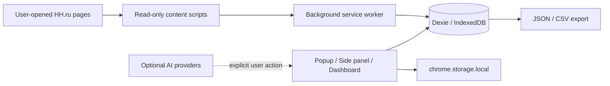

# VacancyPilot

**Local-first HH.ru job-search copilot** for safe vacancy triage, explainable scoring, cover letters and application tracking.

> Read-first. Local-first. No auto-apply. No hidden HH requests.

---

[](https://github.com/VacancyPilot/VacancyPilot/actions/workflows/ci.yml)
[](https://www.typescriptlang.org/)
[](https://react.dev/)
[](https://wxt.dev/)
[](https://developer.chrome.com/docs/extensions/mv3/intro/)
[](#)
[](#)
[](#current-status)

---

## Preview

Screenshots will be added after the next Chrome/Edge manual QA pass.

Planned:
- Vacancy popup
- Side panel
- Dashboard / Kanban
- Search results badges

Repository social preview artwork: [`assets/social-preview/vacancypilot-social-preview.svg`](assets/social-preview/vacancypilot-social-preview.svg)

---

## What It Does

- Extracts visible vacancy data from user-opened HH.ru pages
- Scores vacancies against user profiles with explainable 0–100 breakdown
- Saves and rejects jobs locally (IndexedDB via Dexie)
- Shows search result badges for quick triage
- Tracks application statuses and HR communication timeline
- Prepares cover letter inputs with privacy-first AI assist
- Exports all data as JSON or CSV — no lock-in

---

## What It Does NOT Do

- **No auto-submit** — never submits forms or applications
- **No auto-click** — never programmatically clicks HH.ru controls
- **No form autofill** — never writes values into HH.ru form fields
- **No hidden HH fetch** — no fetch/XHR to HH.ru endpoints from background or content scripts
- **No cookie/session handling** — does not access HH.ru cookies, tokens, or session state
- **Minimal permission surface** — current manifest requests only `storage`, `sidePanel`, `activeTab`
- **No telemetry by default** — no analytics, crash reporting, or usage tracking

---

## Current Status

**Private alpha / dogfooding.**

- CI pipeline with typecheck, lint, unit tests, build, and release-safety tests — green
- Critical dependency alerts — remediated
- High dependency alert backlog — triaged/remediated in the latest security pass
- GitHub infrastructure and security baseline — 90+ % complete
- Data-integrity hardening and runtime browser QA remain before public beta

---

## Tech Stack

| Layer | Technology |
|-------|-----------|
| Extension framework | [WXT](https://wxt.dev/) |
| Manifest | Manifest V3 |
| Language | TypeScript |
| UI | React 19 |
| Local database | Dexie (IndexedDB) |
| Settings / small state | `chrome.storage.local` |
| Testing | Vitest |
| Linting | ESLint |
| CI | GitHub Actions |

---

## Architecture



---

## Quick Start

```bash
pnpm install          # Install dependencies
pnpm dev              # Dev mode with hot reload (Chrome)
pnpm build            # Production build
pnpm typecheck        # TypeScript type-check
pnpm lint             # Lint code
pnpm test             # Run unit tests
pnpm test:release     # Run release-safety tests
```

Load the unpacked extension from `.output/chrome-mv3/` in Chrome Developer mode.

See [`docs/development/private-install-guide.md`](docs/development/private-install-guide.md) for detailed instructions.

---

## Development Safety Checks

Every PR and push to `main` runs through CI:

1. **TypeScript type-check** — `pnpm typecheck`
2. **Lint** — `pnpm lint`
3. **Unit tests** — `pnpm test`
4. **Production build** — `pnpm build`
5. **Release-safety tests** — validates generated manifest, content-script safety, and forbidden automation patterns

Release-safety tests are the project's automated guard against accidentally introducing forbidden HH automation or broad permissions.

---

## Roadmap

| Priority | Workstream | Status |
|----------|-----------|--------|
| P0 | Data Integrity Hardening | Planned |
| P0 | Runtime QA (Chrome / Edge) | Planned |
| P1 | Scoring v2 | Backlog |
| P1 | UI Design System | Backlog |
| P2 | AI Provider Gateway | Backlog |
| P2 | Public Beta Readiness | Backlog |

See [`docs/ROADMAP.md`](docs/ROADMAP.md) for full details and near-term priorities.

---

## Documentation

- [Product specification](docs/Техническое%20заданиеV.1.md)
- [Development pack](docs/development/)
- [Docs index](docs/README.md)
- [Security policy](SECURITY.md)
- [Release notes](docs/release-notes.md)

---

## License

**Not selected yet.** Until a license is added, all rights are reserved by default.
