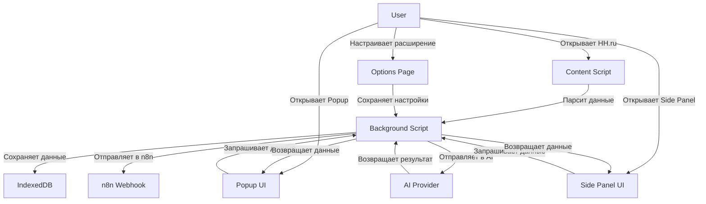
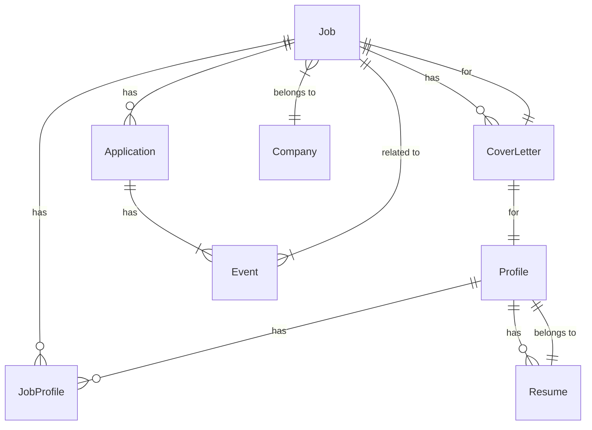

# CareerSignal HH Copilot: Критический Аудит, Улучшенная Стратегия и Детальный План Разработки

---

## 📌 Executive Summary

**CareerSignal HH Copilot** — амбициозный и продуманный проект браузерного расширения для автоматизации и оптимизации поиска работы на HH.ru. Концепция сочетает **user-controlled подход**, **local-first архитектуру**, **гибридный scoring** (rule-based + AI) и **безопасность по умолчанию** — это сильные стороны, которые выделяют проект на фоне спам-ботов.
**Главные риски**: потенциальный бан на HH.ru, сложность интеграции с AI/BYOK, перегрузка MVP лишними функциями, а также недостаточная проработка приватности и безопасности при работе с данными пользователей.

**Рекомендация**:
Сфокусироваться на **MVP-1 с минимальным набором функций**, которые решают самую больную проблему пользователей — **быстрый анализ вакансий и подготовка качественных откликов**. Отложить AI, n8n и автоматизацию откликов на последующие этапы. Внедрить **строгий user-controlled подход** ко всем действиям, чтобы избежать бана.

---

---

## ✅ Что в концепции сильное

### 1. Продуктовая философия
- **User-controlled**: Пользователь управляет всеми действиями — это ключ к безопасности и доверию.
- **Local-first**: Минимизация внешних запросов и хранение данных локально снижает риски утечки и зависимости от backend.
- **Гибридный scoring**: Rule-based + AI позволяет быстро получать результат и углублять анализ по запросу.
- **BYOK (Bring Your Own Key)**: Гибкость в выборе AI-провайдера (DeepSeek/OpenAI/OpenRouter) — плюс для пользователей, которые уже используют эти сервисы.

### 2. Технические решения
- **Manifest V3 + WXT + TypeScript**: Современный стек, подходящий для расширений Chromium.
- **Solid.js/React**: Хороший выбор для UI, особенно если планируется сложный интерфейс в будущем.
- **IndexedDB/Dexie**: Надёжное локальное хранение для структурированных данных.
- **Экспорт CSV/JSON**: Важно для пользователей, которые хотят анализировать данные вне расширения.

### 3. Функциональный фокус
- **Анализ вакансий**: Извлечение ключевых полей (title, salary, skills и т.д.) — это базовая и востребованная функция.
- **Статусы вакансий**: Чёткая система статусов помогает пользователю отслеживать процесс.
- **Шаблоны писем**: Экономия времени при подготовке откликов.

### 4. Безопасность и приватность
- **Минимум данных наружу**: Дефолтный подход — не отправлять данные в AI/n8n без явного согласия пользователя.
- **Хранение только структурированных данных**: Полный HTML только в debug-режиме — правильно.

---

---

## ⚠️ Что в концепции опасно или спорно

---

### 1. Риски бана на HH.ru
#### Проблемы:
- **Автоматизация откликов**: Даже полуавтоматический режим может вызвать подозрения у антибот-систем HH.ru.
- **Частые запросы к API HH.ru**: Если расширение будет слишком активно парсить страницы (например, для скорринга или AI-анализа), это может триггерить защиты.
- **Подстановка текста в форму HH**: Если расширение будет автоматически заполнять поля (например, сопроводительное письмо), это может выглядеть как бот.

#### Способы митигации:
- **Строго ручной режим**: В MVP-1 **никакой автоматизации** — только анализ и подготовка данных.
- **Ограничение частоты запросов**: Не более 1 запроса в секунду, имитация человеческого поведения (задержки, случайные клики).
- **No DOM manipulation для формы HH**: В MVP-1 **не вносить изменения в форму HH** — только показывать пользователю готовый текст для копирования.
- **Проверка CAPTCHA**: Если HH показывает CAPTCHA, расширение должно **приостанавливать работу** и просить пользователя решить её вручную.

---

### 2. Сложность AI-интеграции
#### Проблемы:
- **BYOK**: Пользователи должны сами настраивать API-ключи — это может быть барьером для нетехнических пользователей.
- **Стоимость**: AI-запросы (особенно OpenAI) могут быть дорогими при активном использовании.
- **Зависимость от внешних сервисов**: Если AI-провайдер падает или меняет API, функционал ломается.

#### Способы митигации:
- **AI как опция**: В MVP-1 AI **не обязателен** — только rule-based scoring.
- **Локальный AI**: Рассмотреть возможность использования **локальных моделей** (например, через [LM Studio](https://lmstudio.ai/) или [Ollama](https://ollama.ai/)) для пользователей, которые не хотят отправлять данные во внешние API.
- **Кэширование ответов AI**: Хранить результаты AI-анализа локально, чтобы не повторять запросы.
- **Ограничение длины промптов**: Сокращать текст вакансий до минимально необходимого для анализа.

---

### 3. Перегрузка MVP лишними функциями
#### Проблемы:
- **MVP-1 включает слишком много**: AI-анализ, генерация писем, экспорт CSV/JSON, n8n webhook — это много для первой версии.
- **Сложность тестирования**: Чем больше функций, тем сложнее проверить их все на HH.ru без риска бана.
- **Задержка релиза**: MVP может затянуться, если пытаться сделать всё сразу.

#### Способы митигации:
- **Разбить MVP-1 на 2 этапа**:
  - **MVP-1a**: Анализ вакансий + rule-based scoring + локальное хранение + статусы.
  - **MVP-1b**: Генерация писем (шаблоны) + экспорт CSV/JSON.
- **Отложить AI и n8n** на MVP-2.
- **Отложить автоматизацию откликов** на MVP-3+.

---

### 4. Непроработанная модель данных
#### Проблемы:
- **Неясно, как хранить данные**: Например, как связывать вакансии с профилями кандидата?
- **Неясно, как обрабатывать дубликаты вакансий**: HH.ru может показывать одну и ту же вакансию на разных страницах.
- **Неясно, как обновлять данные**: Если вакансия изменилась на HH.ru, как это отразить в локальном хранилище?

#### Решения:
- Ввести уникальный идентификатор для вакансий (например, `hh_vacancy_id`).
- Хранить хэш контента вакансии для обнаружения изменений.
- Связывать вакансии с профилями через отдельную таблицу (многие ко многим).

---

### 5. Недостаточная проработка UX
#### Проблемы:
- **Как показывать информацию пользователю?** (Side panel? Popup? Badges на странице?)
- **Как избежать перегрузки интерфейса?** (Слишком много информации может отвлекать.)
- **Как пользователь будет взаимодействовать с расширением?** (Клавиатурные сокращения? Горячие клавиши?)

#### Решения:
- **Side panel** для детального анализа вакансии.
- **Badges** на карточках вакансий в поисковой выдаче (например, score, статус).
- **Popup** для быстрых действий (сохранить, отложить, blacklist).
- **Горячие клавиши** для часто используемых функций (например, `Ctrl+Shift+S` — сохранить вакансию).

---

### 6. Неясные требования к безопасности
#### Проблемы:
- **Какие permission запросить у браузера?** (Слишком широкие permission могут напугать пользователей.)
- **Как защитить данные в local storage?** (IndexedDB не шифруется по умолчанию.)
- **Как убедиться, что n8n webhook безопасен?** (Пользователь может случайно отправить данные на небезопасный URL.)

#### Решения:
- **Минимальные permission**:
  - `"activeTab"` — для доступа к текущей вкладке.
  - `"storage"` — для `chrome.storage`.
  - `"scripting"` — для инжекта скриптов (если нужно).
  - **Не запрашивать** `"tabs"`, `"webRequest"`, `"nativeMessaging"` без необходимости.
- **Шифрование локальных данных**: Использовать [Web Crypto API](https://developer.mozilla.org/en-US/docs/Web/API/Web_Crypto_API) для шифрования чувствительных данных (например, API-ключей).
- **Валидация n8n webhook URL**: Проверять, что URL начинается с `https://` и не содержит подозрительных параметров.

---

### 7. Недооценка сложности парсинга HH.ru
#### Проблемы:
- **HH.ru часто меняет DOM**: Если расширение зависит от конкретных классов/селекторов, оно может сломаться после обновления сайта.
- **Динамическая загрузка контента**: Некоторые данные (например, описание вакансии) могут подгружаться асинхронно.

#### Решения:
- **Использовать стабильные селекторы**: Например, атрибуты `data-qa` (если они есть на HH.ru).
- **Ожидание загрузки контента**: Проверять наличие ключевых элементов перед парсингом.
- **Fallback-механизмы**: Если парсинг не удался, показывать пользователю уведомление и предлагать вручную скопировать данные.

---

### 8. Неясная модель монетизации
#### Проблемы:
- **Как проект будет зарабатывать?** (Платные функции? Донат? Open-source?)
- **Будет ли это расширение для себя или для публичного релиза?**

#### Решения:
- **Open-source модель**: Распространять расширение бесплатно, но с возможностью доната.
- **Платные функции**: Например, AI-анализ или расширенные шаблоны писем — только для платных пользователей.
- **Для себя**: Если проект только для личного использования, можно не заморачиваться с монетизацией.

---

---

## 🎯 Исправленная продуктовая стратегия

### 1. Главный фокус MVP-1
**Цель**: Создать **минимально работающий инструмент**, который помогает пользователю **быстро анализировать вакансии и готовить отклики без риска бана**.

**Ключевые принципы**:
- **No automation in MVP-1**: Никакой автоматизации откликов, только анализ и подготовка данных.
- **User-controlled everything**: Пользователь явно подтверждает каждое действие (сохранение, генерация письма, отправка в n8n).
- **Local-first**: Все данные хранятся локально, AI и n8n — опционально.
- **Minimal permissions**: Запрашивать только необходимые permission.

---

### 2. Приоритеты разработки
1. **Безопасность и избегание бана** > Качество функций > Скорость релиза > Архитектурная чистота.
2. **MVP-1 должен решать одну ключевую проблему**: "Как быстро понять, подходит ли вакансия, и подготовить отклик?"
3. **AI и автоматизация — только после валидации базового функционала**.

---

### 3. Изменения в функционале
| **Исходный MVP** | **Предложение** | **Обоснование** |
|------------------|----------------|----------------|
| AI-анализ по кнопке | **Отложить на MVP-2** | Снижает сложность MVP-1, уменьшает риск бана (AI-запросы могут быть подозрительными) |
| Генерация писем | **Оставить, но только шаблоны** | AI-генерация отложить, оставить только редактируемые шаблоны |
| n8n webhook | **Отложить на MVP-2** | Не критичен для MVP-1, добавляет сложность |
| Экспорт CSV/JSON | **Оставить** | Важно для пользователей, которые хотят анализировать данные |
| Подсветка вакансий в поисковой выдаче | **Отложить на MVP-2** | Требует инжекта в DOM HH.ru, что может быть рискованно |
| Очередь откликов | **Отложить на MVP-3** | Слишком сложно для MVP-1 |

---

### 4. Новые требования к безопасности
- **No DOM manipulation для формы HH**: В MVP-1 **не вносить изменения в форму HH** — только показывать пользователю готовый текст для копирования.
- **Ограничение частоты запросов**: Не более 1 запроса в секунду.
- **Проверка CAPTCHA**: Если HH показывает CAPTCHA, расширение **приостанавливает работу**.
- **Шифрование API-ключей**: Хранить ключи AI в зашифрованном виде.
- **Валидация webhook URL**: Проверять, что URL начинается с `https://`.

---

---

## 📦 MVP Scope (Итерации)

---

### 🔹 MVP-1: Анализ вакансий и подготовка откликов (2-3 недели)
**Цель**: Пользователь может проанализировать вакансию на HH.ru, сохранить её локально и подготовить сопроводительное письмо.

#### Функции:
✅ **Анализ страницы вакансии HH**:
- Парсинг: `title`, `company`, `salary`, `city`, `remote/hybrid/office`, `experience`, `description`, `skills`, `source URL`, `HH vacancy id`.
- Обработка саларь (извлечение минимальной/максимальной вилки, валюты).
- Обработка локации (город, страна, удалённость).

✅ **Локальное хранение вакансий**:
- Сохранение в IndexedDB/Dexie.
- Уникальный идентификатор: `hh_vacancy_id`.
- Хранение хэша контента для обнаружения изменений.

✅ **Статусы вакансий**:
- `new`, `viewed`, `saved`, `rejected_by_me`, `letter_ready`, `applied` (ручной режим).
- Статусы обновляются вручную пользователем.

✅ **Rule-based match score**:
- Базовый scoring по ключевым словам, опыту, локации, зарплате.
- Пороговые значения: `low` (<50), `medium` (50-75), `high` (75-85), `very_high` (85+).

✅ **Рекомендации**:
- Откликаться / подумать / пропустить (на основе scoring).
- Причины fit и risk flags (например, "Не хватает навыка X", "Зарплата ниже ожиданий").

✅ **Менеджер профилей кандидата**:
- Редактируемые профили (например, "Universal", "AI Engineer").
- Возможность добавлять/удалять профили.
- Привязка вакансий к профилям (многие ко многим).

✅ **Шаблоны сопроводительных писем**:
- Редактируемые шаблоны (например, "Короткое TG", "HH стандарт", "Уверенное").
- Переключатели: без emoji, без markdown, до 1000/500 символов.
- Возможность сохранять финальную версию письма.

✅ **Экспорт CSV/JSON**:
- Экспорт списка вакансий с выбранными полями.

✅ **UI**:
- **Side panel**: Детальный анализ вакансии (score, статусы, рекомендации, шаблоны писем).
- **Popup**: Быстрые действия (сохранить, отложить, blacklist).
- **Badges**: На странице вакансии (например, score в углу экрана).

✅ **Настройки**:
- Управление профилями.
- Управление шаблонами писем.
- Включение/отключение функций (например, подсветка вакансий).

#### Что НЕ делать в MVP-1:
❌ **AI-анализ** (отложить на MVP-2).
❌ **n8n webhook** (отложить на MVP-2).
❌ **Подсветка вакансий в поисковой выдаче** (отложить на MVP-2).
❌ **Автоматизация откликов** (отложить на MVP-3).
❌ **Очередь откликов** (отложить на MVP-3).
❌ **Работа с откликами/приглашениями/чатами HH** (отложить на MVP-5).

---

### 🔹 MVP-2: Расширенный анализ и интеграции (2-3 недели)
**Цель**: Добавить AI-анализ, подсветку вакансий в поисковой выдаче и интеграцию с n8n.

#### Новые функции:
✅ **AI-анализ по кнопке**:
- Анализ вакансии через DeepSeek/OpenAI/OpenRouter (BYOK).
- Генерация рекомендаций (fit/risk) на основе AI.
- Кэширование результатов AI локально.

✅ **Подсветка вакансий в поисковой выдаче HH**:
- Badges на карточках вакансий (score, статус).
- Быстрые действия из списка (сохранить, отложить).

✅ **n8n webhook**:
- Отправка событий: "отклик отправлен", "HR ответил", "появилась сильная вакансия" (match >= 85).
- Настройки webhook URL в настройках расширения.

✅ **Улучшенный scoring**:
- Гибридный scoring (rule-based + AI).
- Настраиваемые веса для критериев (например, зарплата важнее локации).

✅ **Библиотека удачных писем**:
- Сохранение и категоризация успешных писем.

---

### 🔹 MVP-3: Полуавтоматический отклик (2 недели)
**Цель**: Добавить полуавтоматический режим подготовки откликов.

#### Новые функции:
✅ **Подготовка письма**:
- Автоматическое заполнение шаблона на основе вакансии и профиля.
- Ручная доработка перед отправкой.

✅ **Рекомендация резюме**:
- Подбор подходящего резюме из локального хранилища.

✅ **Подстановка текста в форму HH**:
- Копирование текста письма в буфер обмена (пользователь вставляет вручную).
- **No DOM manipulation** — только копирование в буфер.

✅ **Финальное подтверждение**:
- Пользователь должен явно нажать "Отправить" в HH.ru.

---

### 🔹 MVP-4: Очередь откликов (1-2 недели)
**Цель**: Добавить очередь для обработки вакансий.

#### Новые функции:
✅ **Очередь вакансий**:
- Добавление вакансий в очередь из поисковой выдачи или страницы вакансии.
- Обработка вакансий по одной.

✅ **Кнопки действий**:
- Отправить (показывать готовый текст для копирования).
- Пропустить.
- Отложить.
- Blacklist.

✅ **Автоматическое обновление статусов**:
- После действия обновлять локальный статус вакансии.
- Отправлять webhook в n8n (если настроено).

---

### 🔹 MVP-5: Работа с откликами и уведомлениями (2-3 недели)
**Цель**: Добавить работу с откликами, приглашениями и чатами HH.

#### Новые функции:
✅ **Мониторинг откликов**:
- Отслеживание статуса откликов на HH.ru (если возможно без парсинга приватных страниц).

✅ **Классификация ответов HR**:
- Rule-based классификация (например, "Приглашение на интервью", "Отказ").

✅ **Генерация ответа HR**:
- Шаблоны для ответов HR.
- AI-подсказки (опционально).

✅ **Follow-up reminders**:
- Напоминания о необходимости ответить HR.

✅ **Telegram/n8n уведомления**:
- Отправка уведомлений о новых событиях (отклик отправлен, HR ответил и т.д.).

---

---

## 🏗️ Архитектура Расширения

---

### 1. Технологический стек
| **Компонент**       | **Технология**                          | **Обоснование** |
|----------------------|----------------------------------------|----------------|
| **Manifest**         | Manifest V3                            | Современный стандарт для Chromium |
| **Framework**        | WXT                                    | Удобный фреймворк для расширений на TypeScript |
| **UI**               | Solid.js (или React)                   | Легковесный и быстрый для расширений |
| **Хранение данных**  | IndexedDB + Dexie                      | Надёжное локальное хранение |
| **Настройки**        | chrome.storage.local                   | Простое хранение небольших данных |
| **Стилизация**       | Tailwind CSS или Vanilla CSS           | Быстрая разработка UI |
| **Сборка**           | Vite или esbuild                       | Быстрая сборка для расширений |
| **AI**               | DeepSeek/OpenAI/OpenRouter (BYOK)      | Гибкость для пользователей |
| **Тесты**            | Vitest (unit), Playwright (E2E)        | Надёжное тестирование |

---

### 2. Структура проекта
```
career-signal-hh-copilot/
├── src/
│   ├── background/          # Background scripts (service worker)
│   │   ├── index.ts         # Основной background script
│   │   ├── storage.ts       # Работа с IndexedDB
│   │   ├── api/             # Взаимодействие с AI/n8n
│   │   │   ├── ai.ts        # AI-запросы
│   │   │   └── webhook.ts   # Отправка в n8n
│   │   └── events.ts        # Обработка событий
│   │
│   ├── content/             # Content scripts (инжект в HH.ru)
│   │   ├── vacancy.ts       # Парсинг страницы вакансии
│   │   ├── search.ts        # Парсинг поисковой выдачи
│   │   └── utils/           # Утилиты (селекторы, хелперы)
│   │
│   ├── popup/               # Popup UI
│   │   ├── App.solidx       # Основной компонент
│   │   ├── components/      # UI-компоненты
│   │   └── styles/          # Стили
│   │
│   ├── sidepanel/           # Side panel UI
│   │   ├── App.solidx       # Основной компонент
│   │   ├── components/      # UI-компоненты
│   │   └── styles/          # Стили
│   │
│   ├── options/             # Страница настроек
│   │   ├── App.solidx       # Основной компонент
│   │   └── components/      # UI-компоненты
│   │
│   ├── types/               # TypeScript типы
│   │   ├── models.ts        # Модели данных (Job, Profile, etc.)
│   │   └── events.ts        # Типы событий
│   │
│   ├── utils/               # Утилиты
│   │   ├── scoring.ts       # Rule-based scoring
│   │   ├── templates.ts     # Шаблоны писем
│   │   └── helpers.ts       # Вспомогательные функции
│   │
│   └── _generated/          # Автогенерируемые файлы (например, Manifest)
│
├── public/                 # Статические файлы
│   ├── icons/               # Иконки расширения
│   └── manifest.json        # Manifest V3
│
├── tests/                  # Тесты
│   ├── unit/                # Unit-тесты
│   ├── e2e/                 # E2E-тесты (Playwright)
│   └── fixtures/            # Тестовые данные (HTML-фикстуры для парсинга)
│
├── .env.example             # Пример файла окружения
├── package.json
├── tsconfig.json
└── vite.config.ts           # Конфигурация Vite
```

---

### 3. Взаимодействие компонентов


---

### 4. Потоки данных
1. **Парсинг вакансии**:
   - Content script → Background script → IndexedDB.
   - Background script → Rule-based scoring → Side panel/Popup.
2. **Генерация письма**:
   - User выбирает шаблон → Background script подставляет данные вакансии/профиля → Показывает результат в Side panel.
3. **AI-анализ**:
   - User нажимает "Анализировать" → Background script отправляет запрос в AI → Получает результат → Сохраняет в IndexedDB → Показывает в Side panel.
4. **Экспорт данных**:
   - User нажимает "Экспорт" → Background script извлекает данные из IndexedDB → Формирует CSV/JSON → Скачивает файл.
5. **n8n webhook**:
   - Событие происходит (например, отклик отправлен) → Background script отправляет запрос на webhook URL.

---

---

## 🗃️ Data Model

---

### 1. Сущности и связи


---

### 2. Описание сущностей

#### 📌 Job (Вакансия)
| Поле | Тип | Описание | Пример |
|------|-----|----------|--------|
| `id` | `string` | Уникальный идентификатор (UUID v4) | `"a1b2c3d4..."` |
| `hh_vacancy_id` | `string` | ID вакансии на HH.ru | `"12345678"` |
| `title` | `string` | Название вакансии | `"Senior Product Manager"` |
| `company` | `string` | Название компании | `"Mistral AI"` |
| `company_id` | `string` | ID компании на HH.ru | `"987654"` |
| `salary` | `object` | Зарплата | `{ min: 200000, max: 300000, currency: "RUB", gross: true }` |
| `city` | `string` | Город | `"Москва"` |
| `country` | `string` | Страна | `"Россия"` |
| `remote_type` | `enum` | Тип работы | `"remote" | "hybrid" | "office"` |
| `experience` | `string` | Опыт работы | `"3–6 лет"` |
| `description` | `string` | Описание вакансии (очищенный текст) | `"Требуется Senior Product Manager..."` |
| `skills` | `string[]` | Навыки | `["Product Management", "AI", "Agile"]` |
| `source_url` | `string` | URL вакансии | `"https://hh.ru/vacancy/12345678"` |
| `status` | `enum` | Статус | `"new" | "viewed" | "saved" | "rejected_by_me" | "letter_ready" | "applied" | "hr_replied" | "interview" | "test_task" | "rejected_by_company" | "offer" | "blacklist"` |
| `score` | `number` | Rule-based score (0-100) | `85` |
| `ai_score` | `number` | AI score (опционально, 0-100) | `90` |
| `fit_reasons` | `string[]` | Причины fit | `["Опыт с AI", "Знание Product Management"]` |
| `risk_flags` | `string[]` | Риски | `["Зарплата ниже ожиданий", "Не хватает навыка X"]` |
| `created_at` | `number` | Время создания (timestamp) | `1718800000000` |
| `updated_at` | `number` | Время обновления (timestamp) | `1718800000000` |
| `content_hash` | `string` | Хэш контента для обнаружения изменений | `"sha256:..."` |

---

#### 🏢 Company (Компания)
| Поле | Тип | Описание | Пример |
|------|-----|----------|--------|
| `id` | `string` | Уникальный идентификатор (UUID v4) | `"a1b2c3d4..."` |
| `hh_company_id` | `string` | ID компании на HH.ru | `"987654"` |
| `name` | `string` | Название компании | `"Mistral AI"` |
| `industry` | `string` | Отрасль | `"IT"` |
| `size` | `string` | Размер компании | `"1000+ сотрудников"` |
| `website` | `string` | Сайт компании | `"https://mistral.ai"` |
| `created_at` | `number` | Время создания | `1718800000000` |

---

#### 👤 Profile (Профиль кандидата)
| Поле | Тип | Описание | Пример |
|------|-----|----------|--------|
| `id` | `string` | Уникальный идентификатор (UUID v4) | `"a1b2c3d4..."` |
| `name` | `string` | Название профиля | `"AI Engineer"` |
| `title` | `string` | Желаемая должность | `"Senior AI Engineer"` |
| `specialization` | `string` | Специализация | `"LLM / RAG"` |
| `skills` | `string[]` | Навыки | `["Python", "LLM", "RAG", "LangChain"]` |
| `experience` | `string` | Опыт работы | `"5+ лет"` |
| `salary_expectations` | `object` | Ожидания по зарплате | `{ min: 250000, currency: "RUB" }` |
| `remote_preference` | `enum` | Предпочтение по удалённости | `"remote" | "hybrid" | "office"` |
| `location_preference` | `string[]` | Предпочтительные локации | `["Москва", "Удалённо"]` |
| `created_at` | `number` | Время создания | `1718800000000` |
| `updated_at` | `number` | Время обновления | `1718800000000` |

---

#### 📄 Resume (Резюме)
| Поле | Тип | Описание | Пример |
|------|-----|----------|--------|
| `id` | `string` | Уникальный идентификатор (UUID v4) | `"a1b2c3d4..."` |
| `profile_id` | `string` | ID профиля | `"a1b2c3d4..."` |
| `title` | `string` | Название резюме | `"Resume - AI Engineer"` |
| `file_path` | `string` | Путь к файлу (если хранится локально) | `"resumes/ai_engineer.pdf"` |
| `content` | `string` | Текст резюме (опционально) | `"Опыт работы: 5 лет..."` |
| `created_at` | `number` | Время создания | `1718800000000` |

---

#### 📝 JobProfile (Связь вакансии и профиля)
| Поле | Тип | Описание | Пример |
|------|-----|----------|--------|
| `id` | `string` | Уникальный идентификатор (UUID v4) | `"a1b2c3d4..."` |
| `job_id` | `string` | ID вакансии | `"a1b2c3d4..."` |
| `profile_id` | `string` | ID профиля | `"a1b2c3d4..."` |
| `match_score` | `number` | Score для этой пары | `85` |
| `is_recommended` | `boolean` | Рекомендован ли профиль для этой вакансии | `true` |

---

#### 📬 Application (Отклик)
| Поле | Тип | Описание | Пример |
|------|-----|----------|--------|
| `id` | `string` | Уникальный идентификатор (UUID v4) | `"a1b2c3d4..."` |
| `job_id` | `string` | ID вакансии | `"a1b2c3d4..."` |
| `profile_id` | `string` | ID профиля | `"a1b2c3d4..."` |
| `cover_letter_id` | `string` | ID сопроводительного письма | `"a1b2c3d4..."` |
| `resume_id` | `string` | ID резюме | `"a1b2c3d4..."` |
| `status` | `enum` | Статус отклика | `"draft" | "sent" | "rejected" | "interview"` |
| `sent_at` | `number` | Время отправки | `1718800000000` |
| `created_at` | `number` | Время создания | `1718800000000` |

---

#### 📜 CoverLetter (Сопроводительное письмо)
| Поле | Тип | Описание | Пример |
|------|-----|----------|--------|
| `id` | `string` | Уникальный идентификатор (UUID v4) | `"a1b2c3d4..."` |
| `job_id` | `string` | ID вакансии | `"a1b2c3d4..."` |
| `profile_id` | `string` | ID профиля | `"a1b2c3d4..."` |
| `template_id` | `string` | ID шаблона | `"short_tg"` |
| `content` | `string` | Текст письма | `"Уважаемые..."` |
| `is_ai_generated` | `boolean` | Сгенерировано ли AI | `false` |
| `created_at` | `number` | Время создания | `1718800000000` |
| `updated_at` | `number` | Время обновления | `1718800000000` |

---

#### 📅 Event (Событие)
| Поле | Тип | Описание | Пример |
|------|-----|----------|--------|
| `id` | `string` | Уникальный идентификатор (UUID v4) | `"a1b2c3d4..."` |
| `type` | `enum` | Тип события | `"application_sent" | "hr_replied" | "strong_vacancy" | "daily_summary"` |
| `job_id` | `string` | ID вакансии (опционально) | `"a1b2c3d4..."` |
| `application_id` | `string` | ID отклика (опционально) | `"a1b2c3d4..."` |
| `data` | `object` | Дополнительные данные | `{ score: 90, company: "Mistral AI" }` |
| `sent_to_webhook` | `boolean` | Отправлено ли в n8n | `true` |
| `webhook_response` | `object` | Ответ от webhook (опционально) | `{ status: 200 }` |
| `created_at` | `number` | Время создания | `1718800000000` |

---

#### 📑 Template (Шаблон письма)
| Поле | Тип | Описание | Пример |
|------|-----|----------|--------|
| `id` | `string` | Уникальный идентификатор (UUID v4) | `"short_tg"` |
| `name` | `string` | Название шаблона | `"Короткое TG"` |
| `content` | `string` | Текст шаблона (с плейсхолдерами) | `"Привет, {{hr_name}}!..."` |
| `settings` | `object` | Настройки шаблона | `{ max_length: 500, allow_emoji: false }` |
| `created_at` | `number` | Время создания | `1718800000000` |

---

---

## 🎯 Scoring Model (Rule-Based)

---

### 1. Критерии и веса
| **Критерий**               | **Вес** | **Описание** |
|---------------------------|--------|--------------|
| **Зарплата**              | 25%    | Соответствие ожидаемой зарплате |
| **Локация**               | 15%    | Соответствие предпочтительной локации |
| **Удалённость**           | 10%    | Соответствие предпочтительному типу работы |
| **Опыт работы**           | 10%    | Соответствие опыту кандидата |
| **Навыки**                | 30%    | Соответствие навыкам кандидата |
| **Ключевые слова**        | 10%    | Наличие ключевых слов в описании |

---

### 2. Алгоритм scoring

#### Формула:
```
score = (
  salary_score * 0.25 +
  location_score * 0.15 +
  remote_score * 0.10 +
  experience_score * 0.10 +
  skills_score * 0.30 +
  keywords_score * 0.10
)
```

#### Детали:
1. **Зарплата (`salary_score`)**:
   - Если вакансия указывает вилку (`min` и `max`):
     - `min >= expected_min` → `+50`
     - `max >= expected_min` → `+30`
     - `min <= expected_max` → `+20`
     - `max <= expected_max` → `+0`
   - Если вакансия указывает только `min` или `max`:
     - Сравнивать с `expected_min` и `expected_max`.
   - Если зарплата не указана → `0`.
   - **Нормализация**: `salary_score = min(100, salary_score)`.

2. **Локация (`location_score`)**:
   - Если локация вакансии совпадает с предпочтительной локацией профиля → `100`.
   - Если локация не совпадает, но это удалённая работа → `80`.
   - Иначе → `0`.

3. **Удалённость (`remote_score`)**:
   - Если тип работы вакансии совпадает с предпочтением профиля → `100`.
   - Иначе → `0`.

4. **Опыт работы (`experience_score`)**:
   - Преобразовать опыт вакансии и профиля в числа (например, "3–6 лет" → `4.5`).
   - Если опыт вакансии ≤ опыту профиля → `100`.
   - Если опыт вакансии > опыту профиля на 1 год → `70`.
   - Если опыт вакансии > опыту профиля на 2+ года → `0`.

5. **Навыки (`skills_score`)**:
   - Сравнить навыки вакансии (`job_skills`) и профиля (`profile_skills`).
   - `match_count = количество совпадений`.
   - `skills_score = (match_count / max(len(job_skills), len(profile_skills))) * 100`.

6. **Ключевые слова (`keywords_score`)**:
   - Проверить наличие ключевых слов из профиля в описании вакансии.
   - `match_count = количество совпадений`.
   - `keywords_score = (match_count / len(profile_keywords)) * 100`.

---

### 3. Пример расчёта
**Профиль кандидата:**
- Ожидаемая зарплата: `200 000–300 000 RUB`
- Локация: `Москва`
- Удалённость: `remote`
- Опыт: `5 лет`
- Навыки: `["Python", "LLM", "RAG", "LangChain"]`
- Ключевые слова: `["AI", "LLM", "Product"]`

**Вакансия:**
- Зарплата: `250 000–350 000 RUB`
- Локация: `Москва`
- Удалённость: `remote`
- Опыт: `3–6 лет`
- Навыки: `["Python", "LLM", "SQL", "Docker"]`
- Описание: `"Разработка LLM-решений для product-команд..."`

**Расчёт:**
1. **Зарплата**:
   - `min (250k) >= expected_min (200k)` → `+50`
   - `max (350k) >= expected_min (200k)` → `+30`
   - `min (250k) <= expected_max (300k)` → `+20`
   - Итого: `100` → `salary_score = 100`.

2. **Локация**:
   - Совпадает → `location_score = 100`.

3. **Удалённость**:
   - Совпадает → `remote_score = 100`.

4. **Опыт**:
   - Опыт вакансии: `4.5 года` (среднее между 3 и 6).
   - Опыт профиля: `5 лет`.
   - `4.5 <= 5` → `experience_score = 100`.

5. **Навыки**:
   - Совпадения: `Python`, `LLM` → `2`.
   - `max(len(job_skills), len(profile_skills)) = 4`.
   - `skills_score = (2 / 4) * 100 = 50`.

6. **Ключевые слова**:
   - Совпадения: `LLM`, `Product` → `2`.
   - `len(profile_keywords) = 3`.
   - `keywords_score = (2 / 3) * 100 ≈ 66.67`.

**Итоговый score:**
```
score = (
  100 * 0.25 +
  100 * 0.15 +
  100 * 0.10 +
  100 * 0.10 +
  50 * 0.30 +
  66.67 * 0.10
) = 25 + 15 + 10 + 10 + 15 + 6.67 = 81.67
```

---

### 4. Пороговые значения и рекомендации
| **Score**       | **Рекомендация** | **Действие** |
|----------------|------------------|--------------|
| **85–100**     | Откликаться      | Сильная вакансия, подходит по всем критериям |
| **70–84**      | Подумать         | Подходит, но есть минорные риски |
| **50–69**      | Пропустить       | Недостаточное соответствие |
| **0–49**       | Пропустить       | Не подходит |

---

### 5. Risk Flags
Помимо scoring, расширение должно выявлять **риски**, которые могут быть критичными для кандидата:

| **Тип риска**               | **Условие** | **Описание** |
|----------------------------|------------|--------------|
| **Зарплата ниже ожиданий**  | `max_salary < expected_min` | Вакансия предлагает зарплату ниже минимально ожидаемой |
| **Не хватает навыков**      | `missing_skills.length > 2` | Не хватает более 2 ключевых навыков |
| **Опыт не подходит**        | `job_experience > profile_experience + 2` | Требуется на 2+ года опыта больше, чем у кандидата |
| **Локация не подходит**     | `location != preferred_locations` и `remote_type != "remote"` | Вакансия не в предпочтительной локации и не удалённая |
| **Компания в blacklist**    | `company in blacklist` | Компания находится в чёрном списке пользователя |
| **Слишком низкий score**    | `score < 50` | Вакансия не подходит по большинству критериев |

---

---

## 🤖 AI Prompt Templates

---

### 1. Анализ вакансии
**Цель**: Получить структурированный анализ вакансии для кандидата.

**Промпт:**
```
Ты — эксперт по подбору персонала и анализу вакансий. Проанализируй следующую вакансию с точки зрения кандидата и дай структурированный ответ на русском языке.

**Вакансия:**
- Название: {title}
- Компания: {company}
- Зарплата: {salary}
- Локация: {city}, {country}
- Тип работы: {remote_type}
- Опыт: {experience}
- Навыки: {skills}
- Описание: {description}

**Профиль кандидата:**
- Желаемая должность: {profile_title}
- Специализация: {specialization}
- Навыки: {profile_skills}
- Опыт: {profile_experience}
- Ожидания по зарплате: {salary_expectations}
- Предпочтения по локации: {location_preference}
- Предпочтения по удалённости: {remote_preference}

**Задача:**
1. Оцени, насколько вакансия подходит кандидату по шкале от 0 до 100.
2. Укажи причины fit (что подходит).
3. Укажи риски (что не подходит или вызывает вопросы).
4. Дай рекомендацию: "Откликаться", "Подумать" или "Пропустить".
5. Предложи, какой профиль/резюме кандидата лучше подойдёт для этой вакансии (если есть несколько профилей).

**Формат ответа (JSON):**
```json
{
  "score": <число от 0 до 100>,
  "fit_reasons": ["причина 1", "причина 2"],
  "risk_flags": ["риск 1", "риск 2"],
  "recommendation": "Откликаться" | "Подумать" | "Пропустить",
  "recommended_profile": "<название профиля>" | null
}
```

**Пример ответа:**
```json
{
  "score": 85,
  "fit_reasons": [
    "Зарплата в диапазоне ожиданий",
    "Навыки Python и LLM совпадают",
    "Удалённая работа"
  ],
  "risk_flags": [
    "Требуется знание SQL, которого нет в профиле"
  ],
  "recommendation": "Откликаться",
  "recommended_profile": "AI Engineer / LLM / RAG"
}
```

**Важно:**
- Будь объективным и точным.
- Учитывай контекст IT-рынка в России/СНГ.
- Если данных недостаточно, укажи это в risk_flags.
```

---

### 2. Генерация сопроводительного письма
**Цель**: Сгенерировать качественное сопроводительное письмо на основе вакансии и профиля кандидата.

**Промпт:**
```
Ты — эксперт по написанию сопроводительных писем для IT-вакансий. Напиши сопроводительное письмо для кандидата на вакансию, учитывая все детали.

**Вакансия:**
- Название: {title}
- Компания: {company}
- Зарплата: {salary}
- Локация: {city}, {country}
- Тип работы: {remote_type}
- Опыт: {experience}
- Навыки: {skills}
- Описание: {description}

**Профиль кандидата:**
- Имя: {name}
- Желаемая должность: {profile_title}
- Специализация: {specialization}
- Навыки: {profile_skills}
- Опыт: {profile_experience}
- О себе: {about}

**Требования к письму:**
- Стиль: {style} (короткое TG / HH стандарт / уверенное / очень кратко / EN version)
- Длина: {max_length} символов (если указано)
- Формат: {format} (с emoji / без emoji, с markdown / без markdown, с спецсимволами / без спецсимволов)

**Дополнительные инструкции:**
{additional_instructions}

**Формат ответа:**
Только текст письма, без кавычек и дополнительных пояснений.

**Пример:**
---
Уважаемые коллеги,

Меня заинтересовала вакансия Senior Product Manager в Mistral AI. У меня 5+ лет опыта в управлении продуктами в IT, включая работу с AI-решениями. В текущей роли я занимаюсь разработкой LLM-продуктов, что идеально совпадает с требованиями вакансии.

Буду рад обсудить, как мой опыт может быть полезен вашей команде.

С уважением,
Иурий Изман
---
```

---

### 3. Классификация ответа HR
**Цель**: Классифицировать ответ HR (например, приглашение на интервью, отказ и т.д.).

**Промпт:**
```
Ты — эксперт по классификации ответов HR на отклики кандидатов. Проанализируй следующий текст и классифицируй его.

**Текст ответа HR:**
{hr_response}

**Контекст:**
- Вакансия: {title}
- Компания: {company}
- Статус отклика: {application_status}

**Задача:**
1. Определи тип ответа: "Приглашение на интервью", "Отказ", "Просьба предоставить дополнительную информацию", "Другое".
2. Укажи ключевые моменты из ответа.

**Формат ответа (JSON):**
```json
{
  "type": "Приглашение на интервью" | "Отказ" | "Просьба предоставить дополнительную информацию" | "Другое",
  "key_points": ["момент 1", "момент 2"]
}
```

**Пример ответа:**
```json
{
  "type": "Приглашение на интервью",
  "key_points": [
    "Предлагают собеседование на 20 июня",
    "Формат: онлайн, 1 час"
  ]
}
```
```

---

### 4. Генерация ответа HR
**Цель**: Сгенерировать ответ HR (например, подтверждение интервью, уточняющие вопросы).

**Промпт:**
```
Ты — эксперт по деловой переписке с HR. Напиши ответ на следующее письмо от HR.

**Письмо от HR:**
{hr_message}

**Контекст:**
- Вакансия: {title}
- Компания: {company}
- Имя кандидата: {name}
- Статус отклика: {application_status}

**Тип ответа:** {response_type} (подтверждение интервью / уточняющие вопросы / отказ от предложения / просьба отсрочки)

**Требования:**
- Стиль: профессиональный, вежливый.
- Длина: не более {max_length} символов (если указано).
- Формат: {format} (с emoji / без emoji, с markdown / без markdown).

**Формат ответа:**
Только текст ответа, без кавычек и дополнительных пояснений.

**Пример:**
---
Здравствуйте,

Спасибо за приглашение на собеседование. Подтверждаю, что смогу принять участие 20 июня в 15:00 по Москве.

С уважением,
Иурий Изман
---
```

---

---

## 🎨 UX/UI Структура

---

### 1. Общая концепция
- **Minimalist design**: Не отвлекать пользователя от основной задачи (поиск работы).
- **Consistent color scheme**: Использовать цвета, близкие к HH.ru (синий, серый, белый).
- **Accessibility**: Поддержка тёмной темы, достаточно большой шрифт, контрастные цвета.

---

### 2. Элементы интерфейса

---

#### 🔹 Content Badges (Подсветка на странице HH.ru)
**Цель**: Показывать ключевую информацию прямо на странице HH.ru без открытия side panel.

**Реализация:**
- **На странице вакансии**:
  - Badge с **score** в правом верхнем углу (например, `⭐ 85`).
  - Badge с **статусом** (например, `🔍 Viewed`, `✅ Applied`).
  - Подсветка **ключевых слов** в описании вакансии (цветом или жирным шрифтом).
- **В поисковой выдаче**:
  - Badge с **score** на карточке вакансии.
  - Badge с **статусом** (если вакансия уже просмотрена/сохранена).
  - Цветовая подсветка карточки (например, зелёный для high score, красный для blacklist).

**Пример (CSS для badges):**
```css
.badge-score {
  background: #4CAF50;
  color: white;
  border-radius: 12px;
  padding: 4px 8px;
  font-size: 12px;
  font-weight: bold;
}

.badge-status {
  background: #2196F3;
  color: white;
  border-radius: 12px;
  padding: 4px 8px;
  font-size: 12px;
}
```

---

#### 🔹 Side Panel (Боковая панель)
**Цель**: Детальный анализ вакансии и подготовка отклика.

**Структура:**
```
┌───────────────────────────────────────┐
│  CareerSignal HH Copilot              │
├───────────────────────────────────────┤
│  🔍 Вакансия: Senior Product Manager  │
│  🏢 Компания: Mistral AI               │
│  💰 Зарплата: 200 000–300 000 RUB       │
│  📍 Локация: Москва (Удалённо)         │
│  ⭐ Score: 85 (Высокий)                 │
│  ✅ Статус: New                        │
├───────────────────────────────────────┤
│  📊 Анализ                            │
│  ┌─────────────────────────────────┐ │
│  │ ✅ Подходит:                        │ │
│  │   - Зарплата в диапазоне           │ │
│  │   - Навыки совпадают               │ │
│  │   - Удалённая работа               │ │
│  │ ✖ Риски:                           │ │
│  │   - Не хватает навыка SQL          │ │
│  └─────────────────────────────────┘ │
│  🎯 Рекомендация: Откликаться         │
│  👤 Рекомендуемый профиль: AI Engineer│
├───────────────────────────────────────┤
│  📝 Сопроводительное письмо            │
│  ┌─────────────────────────────────┐ │
│  │ Шаблон: [Короткое TG ▼]           │ │
│  │                                     │ │
│  │ Уважаемые коллеги,                │ │
│  │                                     │ │
│  │ Меня заинтересовала вакансия...   │ │
│  │                                     │ │
│  │ С уважением,                       │ │
│  │ Иурий Изман                       │ │
│  └─────────────────────────────────┘ │
│  [Сохранить] [Скопировать] [AI-оптимизировать] │
├───────────────────────────────────────┤
│  🔄 Действия                          │
│  [Сохранить вакансию] [Добавить в очередь] │
│  [Blacklist] [Отметить как просмотренную] │
└───────────────────────────────────────┘
```

---

#### 🔹 Popup (Всплывающее окно)
**Цель**: Быстрые действия и просмотр статистики.

**Структура:**
```
┌───────────────────────────────────────┐
│  CareerSignal                          │
├───────────────────────────────────────┤
│  📊 Статистика:                         │
│  - Просмотрено: 15                     │
│  - Сохранено: 5                        │
│  - Откликов: 3                         │
├───────────────────────────────────────┤
│  🔍 Последние вакансии:                 │
│  1. Senior PM (Mistral AI) ⭐ 85       │
│     [Просмотреть] [Сохранить]          │
│  2. AI Engineer (Yandex) ⭐ 72         │
│     [Просмотреть] [Сохранить]          │
├───────────────────────────────────────┤
│  ⚙️ Настройки                           │
│  - Открыть настройки                   │
│  - Экспорт данных                      │
└───────────────────────────────────────┘
```

---

#### 🔹 Dashboard/Settings (Панель управления)
**Цель**: Управление профилями, шаблонами, настройками.

**Структура:**
```
┌───────────────────────────────────────┐
│  CareerSignal - Настройки             │
├───────────────────────┬───────────────┤
│  👤 Профили            │  📝 Шаблоны   │
│  ┌───────────────────┐ │  ┌───────────┐ │
│  │ + Новый профиль   │ │  │ + Новый   │ │
│  │ [Universal]       │ │  │ шаблон   │ │
│  │ [AI Engineer]     │ │  │ [Короткое│ │
│  │ [Technical PM]    │ │  │ TG]      │ │
│  └───────────────────┘ │  │ [HH      │ │
│                       │ │  │ стандарт]│ │
│                       │ │  └───────────┘ │
├───────────────────────┼───────────────┤
│  🔧 Общие настройки   │  🔗 Интеграции │
│  - Язык: [Русский ▼] │  │  - n8n      │
│  - Тема: [Светлая ▼]  │  │    Webhook  │
│  - Горячие клавиши   │  │    URL:     │
│                       │  │    [______]│
├───────────────────────┼───────────────┤
│  🔒 Приватность        │  🤖 AI       │
│  - Шифровать API-ключи│  │  - Провайдер│
│  - Очищать данные при  │  │    [DeepSeek│
│    удалении расширения │  │    ▼]      │
│                       │  │  - API ключ │
│                       │  │    [______]│
└───────────────────────┴───────────────┘
```

---

### 3. Горячие клавиши
| **Комбинация**       | **Действие**                          |
|----------------------|---------------------------------------|
| `Ctrl+Shift+S`       | Сохранить вакансию                    |
| `Ctrl+Shift+B`       | Добавить вакансию в blacklist         |
| `Ctrl+Shift+O`       | Открыть side panel                    |
| `Ctrl+Shift+E`       | Экспорт данных в CSV                  |
| `Ctrl+Shift+A`       | Проанализировать вакансию (AI)        |

---

### 4. Уведомления
- **Browser notifications**: Для важных событий (например, "Появилась сильная вакансия").
- **Toast notifications**: Внутри расширения (например, "Вакансия сохранена").
- **n8n/Telegram**: Для уведомлений о событиях (если настроено).

---

---

## 🔒 Security & Privacy Model

---

### 1. Permissions (Разрешения браузера)
**Минимально необходимые permission для MVP-1:**
```json
{
  "permissions": [
    "activeTab",       // Доступ к текущей вкладке
    "storage",         // chrome.storage для настроек
    "scripting"        // Инжект скриптов (для content scripts)
  ],
  "host_permissions": [
    "https://hh.ru/*"  // Только для HH.ru
  ]
}
```
**Что НЕ запрашивать в MVP-1:**
- `"tabs"` — не нужно управлять вкладками.
- `"webRequest"` — не нужно перехватывать запросы.
- `"nativeMessaging"` — не нужно взаимодействие с native-приложениями.
- `"clipboardWrite"` — можно обойтись без копирования в буфер (показывать текст для ручного копирования).

---

### 2. Локальное хранение данных
| **Тип данных**       | **Где хранить**          | **Шифрование** | **Обоснование** |
|----------------------|-------------------------|----------------|----------------|
| Вакансии             | IndexedDB               | ❌ Нет          | Структурированные данные, не чувствительные |
| Профили кандидата    | IndexedDB               | ❌ Нет          | Данные пользователя, но не критичные |
| Шаблоны писем        | IndexedDB               | ❌ Нет          | Не чувствительные |
| Настройки            | chrome.storage.local    | ❌ Нет          | Небольшой объём |
| API-ключи (AI/n8n)   | chrome.storage.local    | ✅ Да (Web Crypto API) | Чувствительные данные |
| События (Events)     | IndexedDB               | ❌ Нет          | Не чувствительные |

**Шифрование API-ключей:**
```typescript
// Пример шифрования с использованием Web Crypto API
async function encryptAPIKey(key: string, secret: string): Promise<string> {
  const encoder = new TextEncoder();
  const iv = crypto.getRandomValues(new Uint8Array(12));
  const encodedKey = encoder.encode(key);
  const encodedSecret = encoder.encode(secret);

  const cipher = await crypto.subtle.encrypt(
    {
      name: "AES-GCM",
      iv,
    },
    await crypto.subtle.importKey(
      "raw",
      encodedSecret,
      { name: "AES-GCM" },
      false,
      ["encrypt", "decrypt"]
    ),
    encodedKey
  );

  const result = new Uint8Array(iv.length + cipher.byteLength);
  result.set(iv);
  result.set(new Uint8Array(cipher), iv.length);
  return btoa(String.fromCharCode(...result));
}
```

---

### 3. AI Data Minimization
**Принцип**: Отправлять в AI **минимально необходимые данные**.

**Что отправлять:**
- Текст вакансии (очищенный, без HTML).
- Ключевые поля профиля кандидата (навыки, опыт, зарплата).

**Что НЕ отправлять:**
- Полный HTML вакансии.
- Персональные данные кандидата (ФИО, контакты).
- Данные о других вакансиях/компаниях.

**Пример запроса к AI:**
```json
{
  "vacancy": {
    "title": "Senior Product Manager",
    "company": "Mistral AI",
    "salary": "200 000–300 000 RUB",
    "description": "Требуется Senior Product Manager для работы с AI-продуктами...",
    "skills": ["Product Management", "AI", "Agile"]
  },
  "profile": {
    "title": "Technical PM",
    "skills": ["Product Management", "AI", "BPMN"],
    "experience": "5 лет",
    "salary_expectations": "250 000 RUB"
  }
}
```

---

### 4. n8n Webhook Safety
**Риски:**
- Пользователь может указать небезопасный URL (например, `http://` вместо `https://`).
- Webhook может быть настроен на отправку данных на подозрительный сервер.

**Меры безопасности:**
1. **Валидация URL**:
   - Проверять, что URL начинается с `https://`.
   - Запрещать `http://`, `localhost`, `127.0.0.1`, private IP-адреса.
2. **Ограничение данных**:
   - Отправлять только минимально необходимые данные (например, `job_id`, `score`, `event_type`).
   - Не отправлять полный текст вакансии или профиля.
3. **Rate limiting**:
   - Ограничивать количество запросов к webhook (например, не более 10 в минуту).
4. **Логирование**:
   - Хранить лог отправленных webhook-запросов локально (для отладки).

**Пример валидации URL:**
```typescript
function isValidWebhookUrl(url: string): boolean {
  try {
    const parsed = new URL(url);
    return (
      parsed.protocol === "https:" &&
      !parsed.hostname.includes("localhost") &&
      !parsed.hostname.includes("127.0.0.1") &&
      !/^10\./.test(parsed.hostname) &&
      !/^192\.168\./.test(parsed.hostname) &&
      !/^172\.(1[6-9]|2[0-9]|3[0-1])\./.test(parsed.hostname)
    );
  } catch {
    return false;
  }
}
```

---

### 5. Очистка данных
**Пользователь должен иметь возможность:**
- Удалять отдельные вакансии/профили/шаблоны.
- Очищать все данные расширения.
- Экспортировать данные перед удалением.

**Реализация:**
```typescript
// Пример функции очистки всех данных
async function clearAllData(): Promise<void> {
  await db.jobs.clear();          // IndexedDB
  await db.profiles.clear();
  await db.templates.clear();
  await chrome.storage.local.clear();
  await chrome.storage.sync.clear();
}
```

---

### 6. Приватность по умолчанию
- **No telemetry**: Не собирать никакую статистику использования без явного согласия пользователя.
- **No tracking**: Не использовать трекинг (Google Analytics и т.д.).
- **Open-source**: Рассмотреть возможность открытия исходного кода для прозрачности.

---

---

## ⚠️ Risks and Mitigations

---

### 1. Риски бана на HH.ru
| **Риск** | **Вероятность** | **Влияние** | **Митигация** |
|----------|----------------|-------------|---------------|
| Частые запросы к странице вакансии | Высокая | Высокое | Ограничить частоту запросов (1 в секунду), добавить задержки |
| Автоматическое заполнение формы HH | Высокая | Высокое | **Не реализовывать в MVP-1-3**, только копирование в буфер |
| Парсинг приватных страниц (отклики, чаты) | Средняя | Высокое | Отложить на MVP-5, использовать только публичные данные |
| Подозрительный user-agent | Низкая | Среднее | Использовать стандартный user-agent браузера |
| CAPTCHA | Средняя | Высокое | Приостанавливать работу расширения, просить пользователя решить CAPTCHA |

---

### 2. Технические риски
| **Риск** | **Вероятность** | **Влияние** | **Митигация** |
|----------|----------------|-------------|---------------|
| Изменение DOM HH.ru | Высокая | Высокое | Использовать стабильные селекторы (`data-qa`), тестировать на новых версиях HH.ru |
| Ошибки парсинга | Высокая | Среднее | Добавить fallback-механизмы, показывать уведомления пользователю |
| Сложность AI-интеграции | Средняя | Среднее | Отложить AI на MVP-2, использовать простые промпты |
| Перегрузка локального хранилища | Низкая | Низкое | Ограничить количество сохранённых вакансий (например, 1000) |
| Утечка API-ключей | Низкая | Высокое | Шифровать ключи с помощью Web Crypto API |

---

### 3. Продуктовые риски
| **Риск** | **Вероятность** | **Влияние** | **Митигация** |
|----------|----------------|-------------|---------------|
| Сложность для нетехнических пользователей | Средняя | Среднее | Сделать интерфейс интуитивным, добавить подсказки |
| Недостаточная полезность MVP-1 | Средняя | Высокое | Сфокусироваться на решении одной ключевой проблемы |
| Конкуренция с другими расширениями | Низкая | Низкое | Уникальная фича: user-controlled + local-first + гибридный scoring |
| Нехватка времени на разработку | Высокая | Высокое | Разбить на небольшие итерации, приоритизировать функции |

---

### 4. Юридические риски
| **Риск** | **Вероятность** | **Влияние** | **Митигация** |
|----------|----------------|-------------|---------------|
| Нарушение ToS HH.ru | Высокая | Высокое | Строго соблюдать правила HH.ru, избегать автоматизации |
| Нарушение GDPR | Низкая | Высокое | Не собирать персональные данные без согласия, хранить данные локально |
| Проблемы с AI-провайдерами | Низкая | Среднее | Использовать BYOK, предупреждать пользователей о стоимости |

---

---

## 📅 Roadmap Разработки (для одного разработчика)

---

### 📌 Фаза 0: Подготовка (1 неделя)
| **Задача** | **Срок** | **Результат** |
|------------|---------|---------------|
| Изучение HH.ru DOM | 1 день | Документация селекторов для парсинга |
| Настройка проекта (WXT, TypeScript, Vite) | 1 день | Рабочий шаблон проекта |
| Проектирование data model | 1 день | TypeScript-типы для всех сущностей |
| Проектирование scoring model | 1 день | Алгоритм rule-based scoring |
| Создание тестовых фикстур (HTML-страницы HH.ru) | 2 дня | Папка `tests/fixtures` с примерами страниц |
| Настройка CI/CD (GitHub Actions) | 1 день | Автоматические тесты и сборка |

---

### 📌 Фаза 1: MVP-1 (2-3 недели)
| **Задача** | **Срок** | **Результат** |
|------------|---------|---------------|
| Реализация парсинга страницы вакансии | 3 дня | Content script для извлечения данных |
| Реализация локального хранения (IndexedDB) | 2 дня | Работа с вакансиями, профилями, шаблонами |
| Реализация rule-based scoring | 2 дня | Функция расчёта score |
| Реализация UI (Popup + Side Panel) | 4 дня | Базовый интерфейс |
| Реализация статусов вакансий | 1 день | Управление статусами |
| Реализация шаблонов писем | 2 дня | Редактор шаблонов |
| Реализация экспорта CSV/JSON | 1 день | Функция экспорта |
| Тестирование на реальных данных | 3 дня | Исправление багов |
| **Итого** | **18 дней** | **MVP-1 готов** |

---

### 📌 Фаза 2: MVP-2 (2-3 недели)
| **Задача** | **Срок** | **Результат** |
|------------|---------|---------------|
| Реализация AI-интеграции (DeepSeek/OpenAI) | 3 дня | Функция отправки запросов в AI |
| Реализация AI-анализа вакансий | 2 дня | Промпты и обработка ответов |
| Реализация подсветки вакансий в поисковой выдаче | 3 дня | Badges на карточках вакансий |
| Реализация n8n webhook | 2 дня | Отправка событий в n8n |
| Улучшение scoring (гибридный) | 1 день | Rule-based + AI scoring |
| Библиотека удачных писем | 1 день | Сохранение и категоризация писем |
| Тестирование | 3 дня | Исправление багов |
| **Итого** | **14 дней** | **MVP-2 готов** |

---

### 📌 Фаза 3: MVP-3 (2 недели)
| **Задача** | **Срок** | **Результат** |
|------------|---------|---------------|
| Реализация полуавтоматического отклика | 3 дня | Подготовка письма и рекомендация резюме |
| Реализация копирования в буфер | 1 день | Копирование текста письма |
| Реализация очереди вакансий | 3 дня | Управление очередью |
| Тестирование | 3 дня | Исправление багов |
| **Итого** | **10 дней** | **MVP-3 готов** |

---

### 📌 Фаза 4: MVP-4 (1-2 недели)
| **Задача** | **Срок** | **Результат** |
|------------|---------|---------------|
| Реализация обработки очереди | 3 дня | Кнопки действий (отправить, пропустить, отложить) |
| Реализация обновления статусов | 1 день | Автоматическое обновление после действий |
| Тестирование | 2 дня | Исправление багов |
| **Итого** | **6 дней** | **MVP-4 готов** |

---

### 📌 Фаза 5: MVP-5 (2-3 недели)
| **Задача** | **Срок** | **Результат** |
|------------|---------|---------------|
| Реализация мониторинга откликов | 4 дня | Отслеживание статуса откликов |
| Реализация классификации ответов HR | 3 дня | Rule-based классификация |
| Реализация генерации ответа HR | 2 дня | Шаблоны и AI-подсказки |
| Реализация follow-up reminders | 2 дня | Напоминания |
| Реализация Telegram уведомлений | 3 дня | Интеграция с Telegram Bot API |
| Тестирование | 3 дня | Исправление багов |
| **Итого** | **17 дней** | **MVP-5 готов** |

---

### 📌 Итоговый Roadmap
| **Фаза** | **Срок** | **Результат** |
|----------|---------|---------------|
| Фаза 0: Подготовка | 1 неделя | Готов шаблон проекта |
| Фаза 1: MVP-1 | 2-3 недели | Базовый анализ вакансий |
| Фаза 2: MVP-2 | 2-3 недели | AI-анализ + интеграции |
| Фаза 3: MVP-3 | 2 недели | Полуавтоматический отклик |
| Фаза 4: MVP-4 | 1-2 недели | Очередь откликов |
| Фаза 5: MVP-5 | 2-3 недели | Работа с откликами и уведомлениями |
| **Итого** | **10-14 недель** | **Полный функционал** |

---

---

## 📝 Список конкретных улучшений для ТЗ

---

### 1. Уточнения по функционалу
1. **AI в MVP-1**:
   - **Исключить** AI-анализ из MVP-1, оставить только rule-based scoring.
   - **Добавить** AI как опциональную функцию в MVP-2.

2. **Автоматизация откликов**:
   - **Исключить** любую автоматизацию в MVP-1-2.
   - **Добавить** полуавтоматический режим (подготовка письма + копирование в буфер) в MVP-3.
   - **Добавить** очередь откликов в MVP-4.

3. **Подсветка вакансий**:
   - **Отложить** подсветку в поисковой выдаче на MVP-2.
   - **Реализовать** только badges (без изменения DOM HH.ru).

4. **n8n webhook**:
   - **Отложить** на MVP-2.
   - **Добавить** валидацию URL и ограничение данных.

5. **Работа с откликами/чатами**:
   - **Отложить** на MVP-5.
   - **Уточнить**, что парсинг приватных страниц HH.ru может нарушать ToS.

---

### 2. Уточнения по безопасности
1. **Permissions**:
   - Использовать только `activeTab`, `storage`, `scripting`.
   - Не запрашивать `tabs`, `webRequest`, `clipboardWrite` без необходимости.

2. **Шифрование**:
   - Шифровать API-ключи с помощью Web Crypto API.
   - Не шифровать вакансии/профили (не чувствительные данные).

3. **AI Data Minimization**:
   - Отправлять в AI только очищенный текст вакансии и ключевые поля профиля.
   - Не отправлять персональные данные (ФИО, контакты).

4. **n8n Safety**:
   - Валидировать webhook URL (только `https://`, нет `localhost`).
   - Ограничивать количество запросов (rate limiting).

---

### 3. Уточнения по UX
1. **Side Panel**:
   - Показывать детальный анализ вакансии.
   - Включать блок для генерации письма.

2. **Popup**:
   - Показывать статистику и последние вакансии.
   - Добавить быстрые действия (сохранить, blacklist).

3. **Badges**:
   - Показывать score и статус на странице вакансии и в поисковой выдаче.
   - Использовать цветовую кодировку (зелёный для high score, красный для blacklist).

4. **Горячие клавиши**:
   - Добавить `Ctrl+Shift+S` (сохранить), `Ctrl+Shift+B` (blacklist), `Ctrl+Shift+O` (открыть side panel).

---

### 4. Уточнения по тестированию
1. **Unit-тесты**:
   - Тестировать парсинг вакансий (использовать HTML-фикстуры).
   - Тестировать scoring model.
   - Тестировать функции работы с хранилищем.

2. **E2E-тесты**:
   - Тестировать взаимодействие с HH.ru (использовать Playwright).
   - Проверять парсинг, сохранение, генерацию писем.

3. **Ручное тестирование**:
   - Тестировать на реальных страницах HH.ru.
   - Проверять работу с разными типами вакансий (с зарплатой/без, удалённые/офис и т.д.).

---

### 5. Уточнения по архитектуре
1. **WXT**:
   - Использовать WXT для удобной разработки расширений.
   - Настроить hot reload для ускорения разработки.

2. **TypeScript**:
   - Использовать строгую типизацию для всех сущностей.
   - Добавить типы для событий и сообщений между компонентами.

3. **Хранение данных**:
   - Использовать Dexie для удобной работы с IndexedDB.
   - Добавить миграции для изменения структуры данных.

---

### 6. Уточнения по roadmap
1. **Приоритеты**:
   - Сначала **MVP-1** (анализ вакансий + rule-based scoring).
   - Затем **MVP-2** (AI + подсветка вакансий + n8n).
   - Потом **MVP-3-5** (автоматизация, очередь, уведомления).

2. **Сроки**:
   - MVP-1: **2-3 недели**.
   - MVP-2: **2-3 недели**.
   - MVP-3-5: **4-8 недель**.

3. **Ресурсы**:
   - Один разработчик может сделать MVP-1 за **2-3 недели** при полной занятости.
   - Для ускорения можно привлечь дизайнера для UI/UX.

---

---

## 🏆 Финальная Рекомендация: Лучший MVP-1

### 1. Цель MVP-1
Создать **минимально работающий инструмент**, который помогает пользователю:
✅ **Быстро анализировать вакансии на HH.ru** (извлечение данных + rule-based scoring).
✅ **Сохранять вакансии локально** с статусами и примечаниями.
✅ **Готовить сопроводительные письма** на основе шаблонов.
✅ **Экспортировать данные** в CSV/JSON для дальнейшего анализа.

**Без:**
❌ AI-анализа.
❌ Автоматизации откликов.
❌ Подсветки вакансий в поисковой выдаче.
❌ n8n webhook.

---

### 2. Минимальный набор функций MVP-1
| **Функция** | **Реализация** | **Приоритет** |
|------------|----------------|---------------|
| Парсинг страницы вакансии | Content script + селекторы | ⭐⭐⭐ |
| Локальное хранение (IndexedDB) | Dexie | ⭐⭐⭐ |
| Rule-based scoring | Алгоритм на основе критериев | ⭐⭐⭐ |
| Статусы вакансий | Управление статусами | ⭐⭐⭐ |
| Шаблоны писем | Редактируемые шаблоны | ⭐⭐⭐ |
| Экспорт CSV/JSON | Функция экспорта | ⭐⭐ |
| Side Panel UI | Показ анализа и писем | ⭐⭐⭐ |
| Popup UI | Быстрые действия | ⭐⭐ |
| Настройки | Управление профилями/шаблонами | ⭐⭐ |

---

### 3. Почему это оптимально?
1. **Минимальный риск бана**:
   - Нет автоматизации, нет частого парсинга, нет изменения DOM HH.ru.
2. **Быстрый релиз**:
   - MVP-1 можно сделать за **2-3 недели**.
3. **Полезность для пользователя**:
   - Решает основную проблему — **быстрый анализ вакансий и подготовка откликов**.
4. **Легкость тестирования**:
   - Можно тестировать на реальных данных без риска бана.
5. **Основы для будущих функций**:
   - Локальное хранение и scoring можно расширить в MVP-2+.

---

### 4. Следующие шаги после MVP-1
1. **Собрать фидбэк** от пользователей:
   - Нравятся ли rule-based scoring и шаблоны писем?
   - Какие функции хотят видеть в первую очередь?
2. **Добавить AI-анализ** (MVP-2):
   - Интеграция с DeepSeek/OpenRouter.
   - Промпты для анализа вакансий.
3. **Добавить подсветку вакансий** (MVP-2):
   - Badges на карточках вакансий в поисковой выдаче.
4. **Добавить n8n webhook** (MVP-2):
   - Отправка событий о сильных вакансиях.
5. **Добавить полуавтоматический отклик** (MVP-3):
   - Генерация писем + копирование в буфер.

---

### 5. Итоговый совет
> **"Сначала сделай простой и надёжный инструмент для анализа вакансий. Automatization later."**

- **Фокусируйся на user-controlled подходе** — пользователь должен явно подтверждать каждое действие.
- **Избегай всего, что может вызвать бан** — никакой автоматизации в MVP-1.
- **Тестируй на реальных данных** — HH.ru часто меняет DOM, поэтому важно проверять парсинг.
- **Держи архитектуру простой** — не усложняй MVP лишними абстракциями.
- **Собирай фидбэк** — это поможет определить, какие функции нужны в первую очередь.

---

---

## 📚 Полезные Ресурсы
1. **WXT**: [Документация](https://wxt.dev/)
2. **Dexie**: [Документация](https://dexie.org/)
3. **Manifest V3**: [Документация Chrome](https://developer.chrome.com/docs/extensions/mv3/)
4. **Playwright**: [Документация](https://playwright.dev/)
5. **HH.ru API (неофициальный)**: [GitHub](https://github.com/hhru/api) (использовать осторожно!)
6. **Web Crypto API**: [MDN](https://developer.mozilla.org/en-US/docs/Web/API/Web_Crypto_API)
7. **n8n**: [Документация](https://docs.n8n.io/)

---

## 🚀 Заключение
**CareerSignal HH Copilot** — это потенциально полезный инструмент для кандидатов, ищущих работу на HH.ru. **Ключ к успеху** — это **безопасность, пользовательский контроль и минимализм в первой версии**.

**Начни с MVP-1**, который решает самую больную проблему: **быстрый анализ вакансий и подготовка откликов**. Отложи AI, автоматизацию и интеграции на последующие этапы. Тестируй на реальных данных, собирай фидбэк и улучшай продукт итеративно.

**Удачи в разработке!** 🚀
Если нужны детали по какому-то разделу — уточняй!
